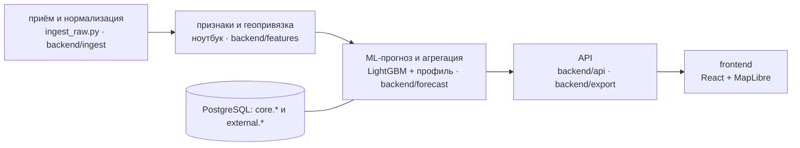

# Пантограф — ИИ-прогноз загрузки трамвайных маршрутов

> **Из данных — энергия, из энергии — прогноз.**

Хакатон Московского транспорта. Прогноз пассажиропотока трамваев Москвы
по схеме `маршрут × дата × час` с веб-сервисом и дашбордом диспетчера.

**Дедлайн: 27 сентября, 23:59 МСК.**

> Этот файл — единая точка входа в проект. Правила и архитектурные решения
> зафиксированы в [CLAUDE.md](CLAUDE.md), подробности — в [`docs/`](docs/).

## Для жюри — за одну минуту

```bash
docker compose up -d          # postgres + backend + frontend, датасет не нужен
```

Откройте **http://localhost:3000/?date=2025-11-08** (сервис готов, когда `http://localhost:8080/actuator/health` = `UP`,
первый запуск ~1–2 мин). Суббота 8 ноября: в «Требует внимания» — провал маршрута 50 на −96% с причиной
(ремонт в Протопоповском переулке) и ссылкой на источник. Дальше — одно нажатие на каждый вопрос:
**День / Месяц / Год** вверху, клик по маршруту или остановке на карте, ползунок часа под картой (▶ — сутки в динамике),
«Поправки» справа, выгрузка **XLSX / CSV / Сабмит** — ровно то, что на экране.

| Обязательный артефакт ТЗ | Где |
|---|---|
| 1. ML-модель, код обучения/инференса, README запуска | [`ml/`](ml/README.md) → [`ML_README.md`](mostrans_handoff/mostrans/ML_README.md), ноутбук, [`data/forecast/`](data/forecast/) |
| 2. Все внешние данные | [`external_data/`](mostrans_handoff/mostrans/external_data/), реестр со ссылками — [docs/external-sources.md](docs/external-sources.md), в сервисе — `GET /api/external` |
| 3. Запускаемый сервис, точки входа API, инструкция | этот раздел, [§8 Запуск](#8-запуск), [§9 API](#9-api), оглавление API — `GET http://localhost:8080/` |
| 4. Схема архитектуры и модулей; область определения и адаптации | [docs/architecture.md](docs/architecture.md), [docs/model-applicability.md](docs/model-applicability.md) |
| 5. Производительность, доп. возможности | [§9 Производительность](#производительность), [perf/](perf/README.md), [§10](#10-дополнительные-возможности) |
| 6. Ограничения и план развития | [§11](#11-ограничения), [§12](#12-план-развития) |

---

## 1. Задача

ЕДЦ ГУП «Московский метрополитен» прогнозирует пассажиропоток наземного транспорта.
Нужен веб-сервис, который помогает диспетчеру распределять подвижной состав,
снижать переполнение салонов и уточнять расписание.

**Цель прогноза:** `boardings(route, date, hour)` — число успешных валидаций
(`validation_result == 1`) на маршруте за календарный час.

**Прогнозный период: 01.11.2025 – 31.12.2025.** Данных за него нет и не будет.
История — только январь–октябрь 2025.

**Метрика:** `WAPE-score = max(0, 1 − Σ|y − ŷ| / Σy)`, больше — лучше.

| WAPE-score | Балл | С весом ×2 |
|---:|---:|---:|
| ≤ 0.48 (baseline) | 0 | 0 |
| 0.48–0.60 | 1 | 2 |
| 0.60–0.70 | 2 | 4 |
| 0.70–0.80 | 3 | 6 |
| 0.80–0.88 | 4 | 8 |
| **> 0.88** | **5** | **10** |

**Результат:** лидерборд **0.89234** — прогон `20260926_1142`, он же подключён к сервису (> 0.88 — максимум критерия),
без подгонки под лидерборд: модель видит только данные до 31.10, погода — архив прогнозов на ≤ 7 дней.
Для сравнения: на внутренней валидации (сен → окт) сезонный профиль даёт ≈ 0.90, но на ноябре–декабре
ему мешают смены режимов (окончание ремонта 7/50, праздники) — их учитывает ансамбль с таблицей режимов.
Потолок по почасовому шуму — ≈ 0.93 (замер in-sample на октябре).

## 2. Критерии оценки (максимум 39)

| № | Критерий | Баллы | Зона ответственности |
|---|---|---:|---|
| 1 | Качество прогноза (WAPE) | 0–10 | ML-команда |
| 2 | Данные, внешние источники, применимость | 0–8 | общая |
| 3 | Архитектура и производительность | 0–5 | **backend** |
| 4 | Полнота функциональности | 0–4 | **backend + frontend** |
| 5 | Бизнес-ценность | 0–2 | frontend + питч |
| 6 | Полуфинальный питч | 0–10 | общая |

**Питч: 5 минут выступления + 5 минут вопросов жюри.**

---

## 3. Ключевые находки в данных

### 3.1. Ремонт в Протопоповском переулке — маршруты 7 и 50

[Источник](https://newsvostok.ru/dlya-tramvaev-7-i-50-izmeneniya-po-vyhodnym-budut-dejstvovat-do-kontsa-oseni/) ·
подробно в [docs/data-anomalies.md](docs/data-anomalies.md)

Работы по выходным с 06.09.2025: маршрут **50 отменён полностью**, маршрут **7 укорочен**.
Будни в норме. Анонсированный срок — «до конца осени»; фактически движение восстановлено
**15.11.2025** ([t.me/DtOperativno/23565](https://t.me/DtOperativno/23565), миграция `V6`).

Внутри прогнозного окна режимы **разные**: до 14.11 выходные аномальные, после — обычные.
Продолжать сентябрьско-октябрьский паттерн на весь горизонт нельзя: учёт окончания работ
поднял лидерборд **0.880 → 0.890**.

### 3.2. Изменения сети внутри прогнозного окна

ТЗ прямо указывает на этот источник: «Расширение за счет внешних данных — …
**данных о строительстве и открытии новых маршрутов**».

| Дата | Событие |
|---|---|
| 12.11.2025 | запуск трамвайного диаметра Т1 |
| 16–17.12.2025 | запуск маршрута 5 «Рижская — Белорусский вокзал» |
| **20.12.2025** | корректировка маршрутов; в справочнике `route_date_start = 2025-12-20` у маршрутов **7, 11, 12** |

7, 11 и 12 — целевые маршруты, вместе ~90 тыс. посадок в сутки. Последние
12 дней горизонта — около **8% Σy**.

Справочник организаторов датирован концом декабря 2025 — февралём 2026.
Это **не ошибочный срез**, а снимок сети на конец прогнозного периода.


---

## 4. Данные

### Что дано (`dataset.zip`, 9.7 ГБ распакованных)

| Файл | Объём | Период |
|---|---|---|
| `train.csv` | 8.2 ГБ, 49 млн событий | янв–авг 2025 |
| `test.csv` | 2.2 ГБ, 13.4 млн событий | сен–окт 2025 |
| `labels/labels_day_train.csv` | 46 234 строки | готовый target |
| `labels/labels_day_test.csv` | 11 317 строк | готовый target |
| `test_submission.csv` | 14 640 строк | шаблон, baseline ≈ 0.48 |
| `spravochniki/*.xlsx` | 491 остановка, 622 строки с координатами | снимок конца 2025 |

### Маршруты

Целевые: **1, 7, 11, 12, 17, 25, 26, 28, 50** — девять, данные полные
(304 дня у всех, у маршрута 50 — 303).

**Маршрут 5 исключается:** в сыром `test.csv` по нему ровно **одна запись**
за два месяца. Организаторы подтвердили ошибку выгрузки и планируют убрать
его из ТЗ.

⚠ До появления обновлённого `test_submission.csv` шлём текущий шаблон
на 14 640 строк с нулями по маршруту 5. Новый шаблон берём **как есть**,
сетку не конструируем сами — иначе сабмит упадёт на проверке ключей
и сожжёт попытку из дневного лимита (36 всего / 24 успешных в день).

### Координаты — только 4 маршрута из 9

Справочник покрывает 1, 2, 3, 4, 5, 6, 7, 10, 11, 12. Пересечение с целевыми —
**1, 7, 11, 12**. По 17, 25, 26, 28, 50 координат нет.

Проверено четырьмя независимыми способами, что номера маршрутов **литеральные**,
а не порядковые индексы: в сырых данных поле `ngpt_route` содержит строки
`17 трамвай`, `25 трамвай`, `50 трамвай`.

### Найденные аномалии

Полностью — в [docs/data-anomalies.md](docs/data-anomalies.md). Кратко:

| Что | Когда | Следствие |
|---|---|---|
| Маршрут 50 выключен по выходным | с 06.09.2025 | исключить из обучения уровня |
| Маршрут 7 укорочен по выходным | с 06.09.2025 | −37% |
| Маршрут 17, работы по отдельным выходным | 12–13.04, 26–27.04 | точечная разметка |
| Скачок уровня у 12 (+58%) и 17 (+26%) | 07.04.2025 | данные до этой даты непригодны для оценки уровня |
| Пропущенный день | 21.09.2025, маршрут 50 | единственный во всём датасете |

### Правила работы с данными

1. Время события — `tran_date_time`. Поле `input_date_time` содержит битые даты.
2. Маршрут — из `ngpt_route`, не из `pass_route`.
3. `place_id` — площадка/депо, **не остановка**.
4. **Час — минимальная единица.** День, месяц, год — агрегация вверх по этой сетке.
5. **Технический шум — только часы 2 и 3** (0.002% объёма, встречаются на 62 и 29
   маршруто-днях из 2736). Часы 0, 1, 4 — **реальная работа**, не фильтровать.
6. **Окно работы задаётся по маршруту:** 1 и 28 — с 5 ч, 25 — с 6 ч, остальные 0–23.
7. **Округление к ближайшему целому — только на выгрузке.** Внутри сервиса прогноз
   дробный: округление до применения коэффициентов накапливает ошибку на каждом множителе.
8. **`crd_hashcode` ≠ пассажир.** 39.4% хэшей встречаются ровно один раз, только 1.31% —
   61+ раз. Токенизация мобильных устройств фрагментирует идентификаторы, смещение
   дрейфует во времени. Признак «уникальные карты» использовать нельзя.

### Две разные величины

| Величина | Определение | Назначение |
|---|---|---|
| `boardings` | только `validation_result = 1` | **цель**, идёт в submission и WAPE |
| `load` | настраиваемый набор кодов, по умолчанию `{1, 90}` | нагрузка на вагон для диспетчера |

Код `90` — 2.5% событий, наиболее вероятно пересадка: пассажир в салоне есть,
а списания нет, потому что идёт взаиморасчёт между операторами. Всего
не-успешных — 4.76%.

---

## 5. Архитектура

### Стек (из ТЗ, не обсуждается)

| Слой | Технология |
|---|---|
| Backend | **Java 21 LTS**, **Spring Boot 4.x**, **Spring WebFlux / Netty** (не MVC, не Tomcat) |
| Хранилище | **PostgreSQL + R2DBC** (реактивный драйвер, нативно ложится на WebFlux) |
| Frontend | **React 19+**, **TypeScript 5.x+**, **MapLibre GL** |
| ML | Python (LightGBM / scikit-learn), артефакты передаются файлами |
| Инфраструктура | **Docker + Docker Compose** |

### Модульное разделение (оцениваемый пункт критерия 3)

```
приём/нормализация → признаки/геопривязка → ML-прогноз/агрегация → API → frontend
```

```
/backend          Java 21 + Spring Boot 4 + WebFlux
  ingest/         приём и нормализация валидаций
  features/       признаки, геопривязка
  forecast/       прогноз, агрегация, отклонения
  api/            REST, DTO, обработка ошибок (RFC 9457)
  export/         CSV / XLSX
/frontend         React 19 + TypeScript
/ml               точка входа ML: веса моделей (artifacts/), ссылки на код
/mostrans_handoff/mostrans   ML-код: ноутбук, pipeline/ingest_raw.py, external_data/
/docs             анализ данных, источники, принципы интерфейса
/perf             нагрузочные тесты и замеры
```

Схема модулей, путь запроса и развёртывание — [docs/architecture.md](docs/architecture.md):



### Ключевые решения

**Прогноз предрассчитывается.** Инференс модели **не в горячем пути HTTP-запроса**.
Прогнозы считаются батчем и кладутся в БД; API делает только выборку и агрегацию.
Поэтому p95 определяется скоростью БД, а не моделью, и «сотни RPS при p95 < 200 мс»
достижимы. Вся сетка прогноза — 14 640 строк, меньше мегабайта.

**Расчёт асинхронный.** Таблица `forecast_run` — задание со статусом и горизонтом.
Годовой прогноз считается отдельно и **не блокирует** короткий. Выдача читает
последний успешный прогон по нужному горизонту.

**Прогнозы иммутабельны.** Новый расчёт создаёт новый `run`, старые остаются —
можно сравнивать прогоны и считать фактическую точность задним числом.

**Мультипликативная модель.** Коэффициенты хранятся **отдельно** от базового прогноза:

```
ŷ = Base × K_calendar × K_school × K_weather × K_event × K_traffic × K_user
```

Поэтому ползунки в UI пересчитывают прогноз **без обращения к модели** — просто
перемножение на выдаче. Это закрывает критерий 2в архитектурно.

**Граница данных.** Основная БД (`core`) — **только данные организаторов**.
Всё внешнее — в схеме `external` с обязательными `source`, `source_url`, `fetched_at`.
Соединяются только на выдаче, множителем. Даёт воспроизводимость без сети,
честность перед жюри и отказоустойчивость.

**Сеть не в критическом пути.** У жюри интернет есть (подтверждено организаторами),
но сервис всегда поднимается на снимке из БД; живое обновление идёт фоном
с жёстким таймаутом. Источник недоступен → коэффициент = 1, прогноз базовый.

**Режимы маршрутов — данные, а не код.** Нашли новый выбитый период — добавили
строку в `core.route_regime`, а не пересобрали образ.

---

## 6. Интерфейс: рабочее место диспетчера

Подробно — [docs/ui-design-principles.md](docs/ui-design-principles.md).

Пользователь — **диспетчер**, элемент системы диспетчеризации и оперативного
управления. Кросс-платформенность (монитор диспетчерской + планшет) обязательна.

1. **Оперативность** — переключения мгновенные, без спиннеров на взаимодействии.
2. **Однозначность обозначений** — номер маршрута читается при любом масштабе
   и одинаков на карте, в таблице, в графике и в экспорте; соответствует мнемосхеме.
   **Цвет и подпись приходят с бэкенда**, не зашиты во фронт.
3. **Минимум паразитных действий** — любой рабочий вопрос закрывается за одно
   действие, максимум за два. Экран по умолчанию уже отвечает на главный вопрос
   смены: где отклонение от обычного уровня.

**Отклонение считается в обе стороны.** Превышение — риск переполнения. Провал —
сбой, снятые вагоны, закрытый участок. Маршрут 50 мы нашли именно так.

Следствия для API: композитные ответы «один экран — один запрос»; справочник
представления маршрутов с сервера; все фильтры — query-параметры (состояние
экрана выразимо ссылкой); отклонение считает бэкенд; экспорт повторяет экран.

---

## 7. Внешние источники (критерий 2а, до 4 баллов)

Полностью с замерами эффекта — [docs/external-sources.md](docs/external-sources.md)
и `EXTERNAL_DATA.md`.

**На каждый источник обязательна рабочая ссылка. Источник без ссылки не засчитывается.**

Эффект измерен в ML-ноутбуке в **потоковом режиме** (модель обучается на данных «до вчера»,
источник выключается по одному). Значения отдаёт `GET /api/coefficients`, они же подписаны
под ползунками поправок в интерфейсе.

| № | Категория ТЗ | Источник | В прогнозе | Измеренный эффект |
|---|---|---|---|---|
| 1 | Календарь | [xmlcalendar](https://github.com/xmlcalendar/data), каникулы | да | фолд с майскими праздниками 0.8145 → 0.8512 (**+3.7 п.п.**) |
| 2 | Погода | [Open-Meteo, архив прогнозов](https://open-meteo.com/en/docs/historical-forecast-api) | да, ≤ 7 дней | дождь днём при t ≥ 10 °C: −1.8% посадок на мм; прогноз на день вперёд **+0.64 п.п.** (фев–окт), летом до +3 |
| 3 | Ремонты, режимы маршрутов | [t.me/DtOperativno/22624](https://t.me/DtOperativno/22624), [23565](https://t.me/DtOperativno/23565), [newsvostok](https://newsvostok.ru/dlya-tramvaev-7-i-50-izmeneniya-po-vyhodnym-budut-dejstvovat-do-kontsa-oseni/) | да | выходные 7: −40%, 50: отменён; учёт восстановления 15.11 — **лидерборд 0.880 → 0.890** |
| 3 | Оперативные сбои (ДТП, контактная сеть) | [t.me/s/DtOperativno](https://t.me/s/DtOperativno), парсер `parse_deptrans_tg.py incidents` | да | 3 часа после сбоя — ×0.83 к профилю; на этих часах 0.770 → 0.829 |
| 4 | Трафик | баллы ЦОДД ([t.me/s/DtOperativno](https://t.me/s/DtOperativno)), онлайн — [Яндекс XML](https://export.yandex.ru/bar/reginfo.xml?region=213) | **нет** | свободные дороги −2.4%, но в потоковой проверке прогноз ухудшается (4 варианта) — в сервисе только ручная поправка `kTraffic` |

Погода в прогнозе — **архив прогнозов** (`weather_fcst`), не факт: в момент прогноза будущей погоды нет.

---

## 8. Запуск

```bash
docker compose up -d
```

| Что | Адрес |
|---|---|
| **Дашборд диспетчера** | http://localhost:3000/?date=2025-11-08 |
| API (оглавление методов) | http://localhost:8080/ |
| Проверка живости | http://localhost:8080/actuator/health |
| PostgreSQL | `localhost:5432`, база/пользователь/пароль `tram` |

**Для жюри — демо за 15 секунд:** откройте http://localhost:3000/?date=2025-11-08.
Суббота 8 ноября: сервис сам выводит в «Требует внимания» провал маршрута 50 на −96%
с причиной (ремонт путей в Протопоповском переулке) и ссылкой на источник.
Клик по карточке — карта приближается к маршруту, справа почасовой профиль
«прогноз против обычного уровня».

### Данные при запуске

**Датасет для запуска не нужен.** Всё, что требуется сервису, лежит в репозитории: прогноз ML, геометрия,
внешние источники и `data/load/load_hourly.csv` — агрегат сырых валидаций, чьи `boardings` совпадают
с labels организаторов на всех 57 551 ключах; из него берутся факт и «обычный уровень», если labels нет.
Если датасет есть — положите распакованный `dataset/` в `./ИИ-прогноз пассажиропотока/dataset` или укажите путь:

```bash
DATASET_DIR=/путь/к/dataset docker compose up -d
```

| Файл | Откуда | Что даёт |
|---|---|---|
| `dataset/labels/*.csv` | организаторы | исторический факт, «обычный уровень» |
| `data/forecast/forecast_hourly.csv` | ML-ноутбук | прогноз ноябрь–декабрь без округления: `route;date;hour;pred;model_version` |
| `data/forecast/forecast_year_monthly.csv` | ML-ноутбук | горизонт «год» помесячно — масштабирует годовой прогон сервиса |
| `data/forecast/coefficients.json`, `ml_contract.json` | ML-ноутбук | коэффициенты с измеренными эффектами и ссылками; контракт модели → `GET /api/coefficients` |
| `data/forecast/submission_latest.csv` | ML-ноутбук | запасной вариант, если нет `forecast_hourly.csv` (`route;date;hour;prediction`) |
| `data/load/load_hourly.csv` | `tools/build_load.sh` из сырых 10 ГБ (~8 мин) | нагрузка на вагон с пересадками; `boardings` совпадает с labels организаторов на всех 57 551 ключах |
| `data/geo/routes_osm.json` | OpenStreetMap (ODbL) | трассы и остановки 9 маршрутов |
| `mostrans_handoff/mostrans/external_data/` | ML-команда, ссылки в [реестре](docs/external-sources.md) | снимок внешних источников → схема `external.*` |

При старте: миграции схемы (Flyway) → загрузка факта (labels или `load_hourly.csv`) → импорт прогноза ML как
прогона → расчёт обычного уровня → фоновый годовой прогон; параллельно — внешние источники в `external.*`
(каждая загрузка — строка в `external.fetch_log`). Пока загрузка не закончена, `/actuator/health` отвечает `DOWN`. Повторный запуск
ничего не дублирует; **новая версия модели** (другой `model_version` в файле)
импортируется новым прогоном, выдача переключается на неё, старые прогоны остаются.

### Обновить прогноз из ML-ноутбука

Ноутбук `mostrans_handoff/mostrans/baseline_colab.ipynb` (описание — [`ML_README.md`](mostrans_handoff/mostrans/ML_README.md))
в конце прогона сохраняет и скачивает `service_artifacts.zip`:

```bash
tools/sync_ml_artifacts.sh ~/Downloads/service_artifacts.zip   # раскладывает файлы в data/forecast/
docker compose restart backend
```

Лимиты ресурсов в `docker-compose.yml` заданы явно (2 vCPU / 2 ГБ на бэкенд) —
замеры в [`perf/`](perf/) сделаны в этих условиях.

---

## 9. API

Все методы — `GET`, кроме запуска прогона. Все фильтры — query-параметры,
поэтому любое состояние экрана выражается ссылкой. Оглавление с примерами —
на корне сервиса: `GET /`.

### Методы

| Метод | Назначение |
|---|---|
| `GET /api/meta` | периоды факта и прогноза, версии моделей, дата по умолчанию |
| `GET /api/routes` | справочник маршрутов: номер, название, **цвет**, часы работы |
| `GET /api/geometry` | трассы и остановки всех маршрутов одним GeoJSON |
| `GET /api/dashboard?date=` | главный экран диспетчера **одним запросом** |
| `GET /api/forecast` | прогноз по параметрам ТЗ: маршрут, интервал, горизонт |
| `GET /api/attention?date=` | отклонения от обычного уровня в обе стороны |
| `GET /api/stops?route=` | остановки маршрута с долей посадок (для `stop` в `/api/forecast`) |
| `GET /api/coefficients` | корректирующие коэффициенты: ручки сценария, измеренные эффекты источников со ссылками, контракт ML-модели |
| `GET /api/external?date=` | внешние источники: ссылка, время и статус загрузки, последний балл пробок; контекст суток (календарь, прогноз погоды, события) |
| `GET /api/export` | выгрузка CSV / XLSX / формат сабмита |
| `POST /api/forecast/runs?horizon=year` | фоновый пересчёт годового прогноза |
| `GET /api/forecast/runs/{id}` | статус прогона |

### `GET /api/forecast` — прогноз по параметрам ТЗ

| Параметр | Значения | По умолчанию |
|---|---|---|
| `route` | номер маршрута: 1, 7, 11, 12, 17, 25, 26, 28, 50 | все |
| `stop` | название остановки (список — `GET /api/stops?route=`); без `route` — все маршруты через остановку | — |
| `horizon` | `day` — почасово за дату; `month` — по дням за месяц; `year` — по месяцам за год | `day` |
| `date` | опорная дата, `ГГГГ-ММ-ДД` | начало прогнозного периода |
| `from`, `to` | явный интервал, перекрывает горизонт | — |
| `granularity` | `hour`, `day`, `month` — детализация агрегации | по горизонту |
| `kWeather`, `kEvent`, `kSeason`, `kTraffic`, `kManual` | корректирующие коэффициенты 0.3–3.0 | 1 |

Час — минимальная единица; день, месяц и год — агрегация вверх по той же сетке,
поэтому цифры на всех горизонтах сходятся.

**Остановка / участок.** В валидациях остановки нет (`place_id` — депо, не остановка), поэтому прогноз
остановки — **оценка распределением** прогноза маршрута по его остановкам (трассы и остановки — OpenStreetMap):
вес остановки = 1 + 0.5 × (число других трамвайных маршрутов на ней), остановка на двух направлениях
считается дважды, доли маршрута в сумме дают 1. Участок = сумма остановок участка. Доли — `GET /api/stops`.
Это ограничение метода, а не наблюдение: при появлении данных посадок по остановкам (валидатор ↔ GPS борта)
доли заменяются измеренными без изменения API.

```bash
curl "http://localhost:8080/api/forecast?route=17&horizon=month&date=2025-11-15"
```

```json
[{
  "routeId": 17, "shortName": "17", "color": "#C1292E",
  "forecastTotal": 1458433.0, "loadTotal": 1500727.8, "baselineTotal": 1479617.5, "deviationPct": -1.4,
  "points": [
    {"t": "2025-11-01", "forecast": 47580.0, "load": 49302.8, "baseline": 41216.0, "actual": null, "deviationPct": 15.4}
  ]
}]
```

| Поле | Смысл |
|---|---|
| `forecast` | прогноз посадок (`validation_result = 1`) — целевая величина ТЗ, с учётом коэффициентов |
| `load` | нагрузка на вагон **с пересадками**: прогноз × отношение (коды 1 и 90) / (код 1) из истории |
| `baseline` | обычный уровень: медиана последних 8 одноимённых дней недели вне режимов (ремонтов); если эти дни старше 4 недель — приведены к текущему уровню будней маршрута (иначе после ремонта обычные выходные выглядели бы «превышением») |
| `actual` | факт, если дата в истории (январь–октябрь 2025) |
| `deviationPct` | отклонение прогноза от обычного уровня, % |

### `GET /api/dashboard?date=` — главный экран

Один ответ содержит всё для экрана диспетчера: справочник маршрутов, почасовые
ряды 9 маршрутов, список отклонений, активные режимы маршрутов (ремонты, приостановки)
с источниками, внешний контекст суток (календарь, прогноз погоды, посты Дептранса), итог по сети. Принимает те же `k*`-коэффициенты и `threshold`
(порог отклонения в %, по умолчанию 10).

### `GET /api/attention?date=` — отклонения

Маршруты, у которых суточный прогноз отличается от обычного уровня больше чем
на `threshold` %, **в обе стороны**: `above` — риск переполнения, `below` — сбой,
снятые вагоны или закрытый участок. Отсортированы по абсолютной разнице
в пассажирах; `peakHour` — час наибольшего расхождения, `reason` — причина из
режима маршрута. Принимает те же `k*`, что и главный экран.

### `GET /api/export` — выгрузка

| `format` | Что |
|---|---|
| `csv` | таблица как на экране: маршрут, период, прогноз, нагрузка, обычный уровень, факт, отклонение |
| `xlsx` | то же в Excel |
| `submission` | **ровно формат сабмита организаторов** `route;date;hour;prediction`: полная сетка 10 маршрутов × дни × 24 часа (за ноябрь–декабрь — 14 640 строк), маршрут 5 — нулями |

Параметры: `from`, `to` (обязательны), `route`, `stop`, `granularity`, `k*` — те же, что на экране.
Округление к ближайшему целому (half-up) — только в выгрузке и один раз, из дробных значений сервиса.

### Ошибки

Формат — [RFC 9457 Problem Details](https://www.rfc-editor.org/rfc/rfc9457),
сообщения на русском, без стектрейсов:

```json
{"type": "about:blank", "status": 404, "title": "Нет прогноза на дату",
 "detail": "На дату 2027-01-01 прогноза нет. Почасовой прогноз: 2025-11-01 — 2025-12-31. Годовой: 2025-11-01 — 2026-10-31.",
 "instance": "/api/dashboard"}
```

| Ситуация | Статус |
|---|---|
| дата вне периода прогноза | 404, с указанием доступных периодов |
| неизвестный маршрут | 404, со списком доступных |
| коэффициент вне 0.3–3.0, неизвестный горизонт или формат | 400 |
| дата не в формате `ГГГГ-ММ-ДД` | 400, с названием параметра |
| прогноз ещё не загружен | 503 |

### Производительность

Один контейнер бэкенда **2 vCPU / 2 ГБ RAM**, прогон модели `ml-20260926_1142` (26.09.2026).

**Смешанный трафик** (главный экран на случайные даты и коэффициенты, прогноз маршрута на день/месяц/год,
прогноз остановки, зоны внимания, выгрузка CSV; 2 199 уникальных URL), фиксированная частота, 30 с на ступень:

| Нагрузка | p95 | p99 | Успешно | CPU (из 2 vCPU) | RAM |
|---:|---:|---:|---:|---:|---:|
| 800 RPS | 1.6 мс | 2.1 мс | 100% | 24% | 1.71 ГБ |
| **1 500 RPS** | **3.0 мс** | **25 мс** | **100%** | **49%** | **1.71 ГБ** |
| **2 500 RPS** | **102 мс** | 4.0 с | **100%** | **68%** | **1.72 ГБ** |
| 3 000 RPS | 219 мс | 3.8 с | 99.2% | 89% | 1.72 ГБ |
| 3 500 RPS | насыщение | — | 70% | 100% | 1.72 ГБ |

**Итог:** 1 500 RPS с большим запасом (p95 3 мс, CPU 49%); 2 500 RPS — p95 102 мс при CPU 68%, без ошибок,
но хвост p99 уже секунды — предел одного контейнера. RAM стабильна (1.7 из 2 ГБ), без swap.
Дальше — горизонтальное масштабирование (инстансы stateless).

**Один URL, максимум** (hey, 50 соединений): главный экран 5 673 RPS / p95 55 мс, месяц по маршруту
3 030 RPS / p95 65 мс, зоны внимания 5 324 RPS / p95 56 мс, ноль ошибок.

Стенд — ноутбук, клиент нагрузки на той же машине: цифры занижены относительно выделенного сервера.

Методика, условия и воспроизведение — [perf/README.md](perf/README.md).

---

## 10. Дополнительные возможности

Сверх обязательного минимума ТЗ:

| Возможность | Зачем диспетчеру | Где |
|---|---|---|
| **«Требует внимания»** — отклонение от обычного уровня в обе стороны, с причиной и ссылкой на источник | провал = сбой, снятые вагоны, закрытый участок; превышение = риск переполнения | `GET /api/attention`, левая панель |
| **Рекомендация по выпуску** в пиковый час: на сколько % поднять провозную способность или можно сократить выпуск | распределение подвижного состава (критерий 5) | правая панель, режим «День» |
| **Нагрузка на вагон с пересадками** (коды 1 и 90) рядом с целевыми посадками | реальное наполнение салона больше числа оплат на 2.5% | поле `load` во всех ответах |
| **Динамика по остановкам на карте**: размер остановки — прогноз посадок в выбранный час, ▶ проигрывает сутки | где и когда сеть загружена | ползунок под картой |
| **Внешний контекст суток**: календарь, прогноз погоды, посты Дептранса о работах и сбоях — со ссылками | почему прогноз отличается от обычного | левая панель, `GET /api/external` |
| **Режимы маршрутов как данные** (`core.route_regime`): ремонт, отмена, сдвиг уровня | новый ремонт — строка в таблице, без пересборки | миграции V3–V6 |
| **Выгрузка в формате сабмита** организаторов | сверка с проверяющей системой | `GET /api/export?format=submission` |
| **Состояние экрана — ссылка**: дата, горизонт, маршрут, остановка, час, поправки | передать картину смене одной ссылкой | адресная строка |
| **Иммутабельные прогоны** с версией модели, фоновый пересчёт года | сравнение версий, выдача не ломается при переобучении | `core.forecast_run`, `POST /api/forecast/runs` |
| **Онлайн-балл пробок** Яндекса фоном, с журналом загрузок | готовность к включению трафика в модель | `external.traffic_score`, `external.fetch_log` |
| Интерфейс для монитора диспетчерской и планшета | одна и та же информация, другая раскладка | `styles.css`, `@media` |

## 11. Ограничения

Полностью — [docs/model-applicability.md](docs/model-applicability.md). Главное:

- **Остановки — оценка, а не наблюдение.** В валидациях нет остановки (`place_id` — депо), поэтому прогноз остановки —
  доля прогноза маршрута по весам остановок (OSM, пересадочные узлы весомее). Для реального распределения нужны
  посадки по остановкам (валидатор ↔ GPS борта).
- **Год — качественный сценарий**: 10 месяцев истории, ноябрь–декабрь без прошлогодних аналогов; помесячные объёмы от ML,
  раскладка — сезонный профиль 2025 года.
- **Необъявленные смены режима** (внезапные ремонты) модель узнаёт только из таблицы режимов; до этого ошибка по маршруту 30–100%.
- **Новогодняя неделя** — экспертные коэффициенты: декабря в истории нет.
- **Трафик** собран и загружается, но в прогноз не включён: в потоковой проверке он ухудшал точность (4 варианта).
  В интерфейсе — только ручная поправка `kTraffic`.
- **Маршрут 5** — вне области определения (ошибка выгрузки организаторов), в сабмите нули.
- **Замеры производительности** — на ноутбуке, клиент нагрузки делит машину с сервисом: цифры занижены
  относительно выделенного сервера.

## 12. План развития

| Горизонт | Что | Эффект |
|---|---|---|
| 1 месяц | Ежедневное переобучение на данных «до вчера» (потоковый режим уже проверен бэктестом) и загрузка прогона по расписанию | прогноз на день вперёд ≈ 0.91 вместо 0.89 на 61 день |
| 1 месяц | Автоматический разбор постов Дептранса о работах в `core.route_regime` с подтверждением диспетчером | режимы появляются в прогнозе в день публикации |
| 1–3 месяца | Посадки по остановкам из связки «валидатор ↔ GPS борта» (телематика) | измеренные доли остановок вместо оценки, прогноз по участкам |
| 1–3 месяца | Провозная способность: наряды, число выходов и вместимость вагонов → «нужно N вагонов» вместо % | прямое планирование выпуска |
| 3–6 месяцев | Трафик по участкам маршрута (а не балл по городу) как признак модели | подтверждение эффекта трафика |
| 3–6 месяцев | Внутридневная коррекция по потоку валидаций в реальном времени (приём событий в API) | оперативная реакция на сбои в течение часа |
| 6–12 месяцев | Все виды наземного транспорта: код не привязан к трамваю, кроме справочников и таблицы режимов | единая модель для автобусов и электробусов |
| — | Инференс в JVM (ONNX Runtime) для пересчёта сценариев без ноутбука | модель как сервис, без ручной выгрузки артефактов |

## 13. Документы проекта

| Файл | Содержание |
|---|---|
| [CLAUDE.md](CLAUDE.md) | зафиксированные требования и архитектурные решения |
| [docs/architecture.md](docs/architecture.md) | схема модулей, путь запроса, развёртывание, хранилище |
| [docs/model-applicability.md](docs/model-applicability.md) | область определения и адаптации модели (критерий 2б) |
| [docs/external-sources.md](docs/external-sources.md) | реестр внешних источников со ссылками и эффектом |
| [docs/data-anomalies.md](docs/data-anomalies.md) | аномалии, режимы маршрутов, правила очистки |
| [docs/ui-design-principles.md](docs/ui-design-principles.md) | принципы интерфейса диспетчера |
| [docs/criteria-checklist.md](docs/criteria-checklist.md) | чек-лист критериев ТЗ |
| [docs/references.md](docs/references.md) | похожие решения |
| [ml/README.md](ml/README.md), [ML_README.md](mostrans_handoff/mostrans/ML_README.md) | ML-модель: запуск, параметры, артефакты |
| [perf/README.md](perf/README.md) | методика и результаты нагрузочного теста |
| `EXTERNAL_DATA.md`, `ML_IDEAS.md` | материалы ML-команды |
