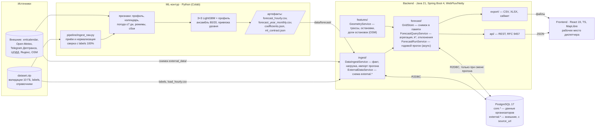
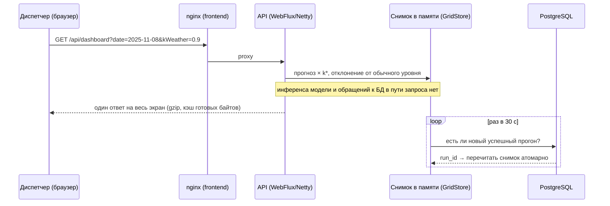
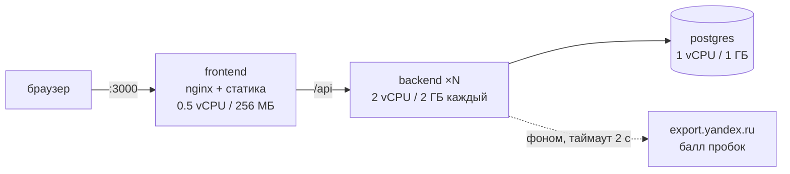

# Архитектура и модули

Схема соответствует критерию 3 ТЗ: **приём/нормализация → признаки/геопривязка → ML-прогноз/агрегация → API → frontend**.
Каждый этап — отдельный модуль с явной границей (файл-контракт или интерфейс сервиса), а не сквозные вызовы.

## 1. Модули и потоки данных

| Этап ТЗ | Где | Граница (контракт) |
|---|---|---|
| Приём и нормализация | `ml/pipeline/ingest_raw.py` (сырые 62 млн событий → `route × date × hour`), `tools/build_load.sh`, `backend/.../ingest/` | `labels/*.csv`, `data/load/load_hourly.csv`: `route;date;hour;boardings;load` |
| Признаки и геопривязка | ноутбук ML (календарь, погода, режимы, сбои), `backend/.../features/GeometryService` (трассы и остановки OSM, доли остановок) | `data/geo/routes_osm.json`, схема `external.*` |
| ML-прогноз и агрегация | ноутбук `ml/pantograph_best_colab.ipynb` → артефакты; `backend/.../forecast/` агрегирует час → день → месяц → год | `data/forecast/forecast_hourly.csv`: `route;date;hour;pred;model_version` + `ml_contract.json` |
| API | `backend/.../api/`, `backend/.../export/` | REST, JSON, RFC 9457 ([README §9](../README.md#9-api)) |
| Frontend | `frontend/` | те же query-параметры, что в API: состояние экрана = ссылка |

## 2. Путь запроса

- **Прогноз предрассчитан.** Модель не в горячем пути: p95 определяется выборкой из памяти, а не инференсом.
- **Коэффициенты на выдаче.** `ŷ = прогноз модели × kWeather × kEvent × kSeason × kTraffic × kManual` — пересчёт без модели.
- **Прогоны иммутабельны.** Новая `model_version` → новый `forecast_run`, выдача переключается атомарно, старые прогоны остаются.
- **Stateless.** Состояние — только в PostgreSQL; инстансы взаимозаменяемы за балансировщиком.

## 3. Развёртывание

`docker compose up -d` поднимает все три сервиса. Внешняя сеть не в критическом пути: при недоступности источника
сервис работает на снимке, коэффициент = 1, сбой виден в `external.fetch_log` и `GET /api/external`.

## 4. Хранилище

| Схема | Что | Откуда |
|---|---|---|
| `core.route`, `core.route_regime` | справочник маршрутов (цвет, подпись, часы работы), режимы — **данные, не код** | миграции Flyway V3–V6 |
| `core.actual_hourly` | факт `route × date × hour`: посадки и нагрузка с пересадками | labels организаторов или `load_hourly.csv` |
| `core.forecast_run`, `core.forecast_hourly` | прогоны прогноза (день — из ML, год — фоновый расчёт), дробные значения | артефакты ML, `ForecastRunService` |
| `external.*` | календарь, погода (факт и архив прогнозов), события, сбои, баллы пробок, журнал загрузок | `external_data/` ML-команды + онлайн Яндекс |

Внешние данные с данными организаторов в одной таблице не смешиваются: соединение — только на выдаче.
